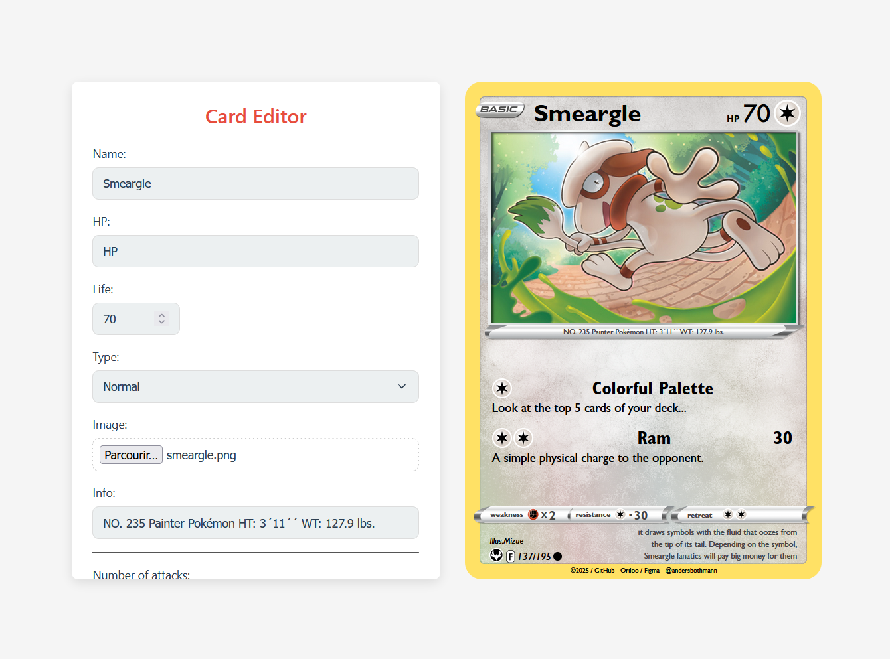

# PokéCardMaker

## 🎴 Description
PokéCardMaker vous permet de créer facilement vos propres cartes Pokémon directement depuis votre navigateur. Personnalisez, sauvegardez et exportez vos cartes en JSON ou PNG haute résolution.

## Fonctionnalités
- Édition et personnalisation simple avec formulaire
- Export PNG et JSON
- Prévisualisation en temps réel
- Interface responsive pour tous les écrans

## 📌 [👉 Essayez en ligne !](https://Oriloo.github.io/PokeCardMaker)

## 🛠️ Technologies
- HTML5, CSS3, JavaScript
- Librairie : `dom-to-image-more`

## 🖼️ Capture d'écran

## 📢 Contributions
Les contributions sont bienvenues via des issues ou pull requests.

## 🎨 Crédits
- Design original : [@andersbothmann](https://www.figma.com/community/file/1223615632548850776)
- Développement : [Oriloo](https://github.com/Oriloo)

---

**2025 PokéCardMaker**
